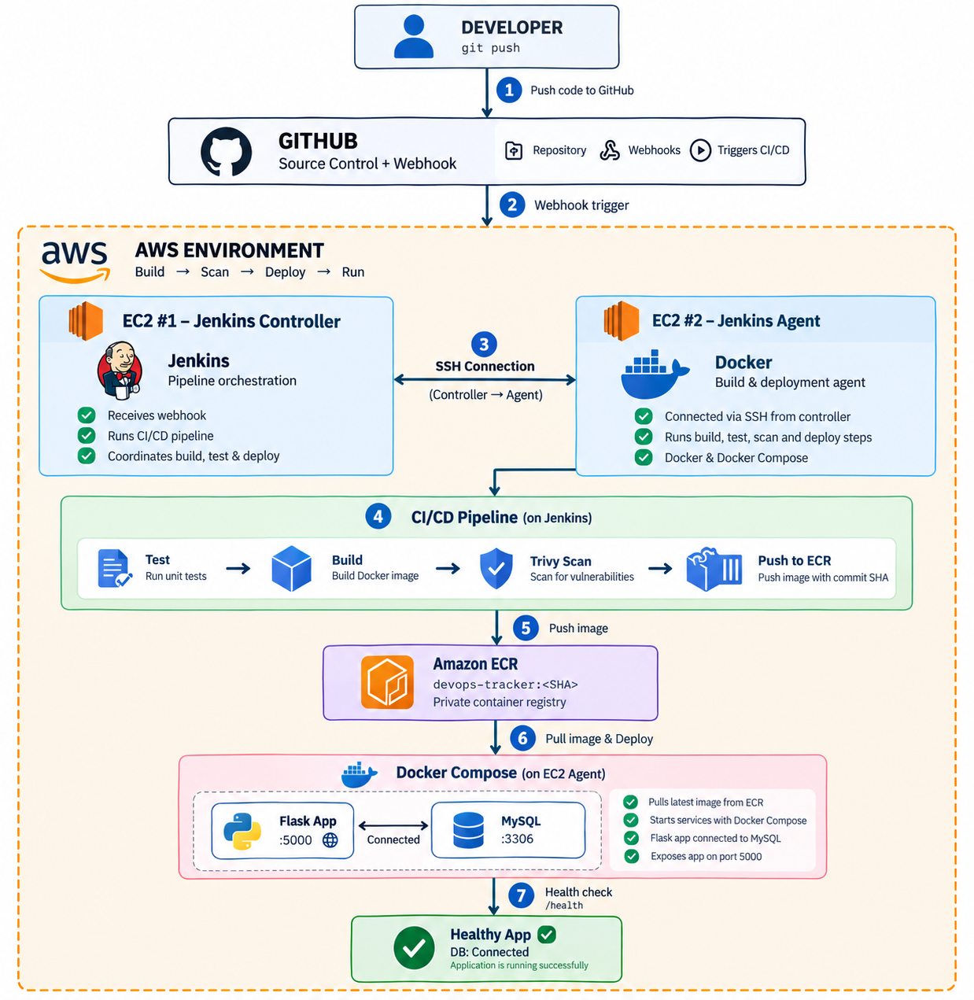
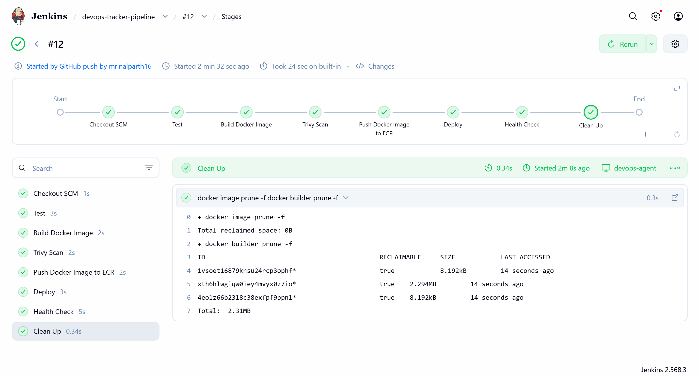
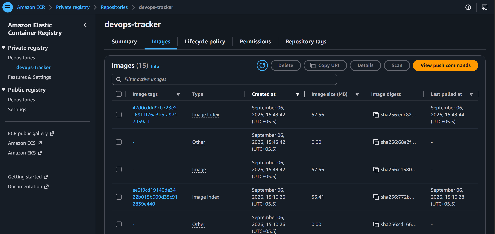
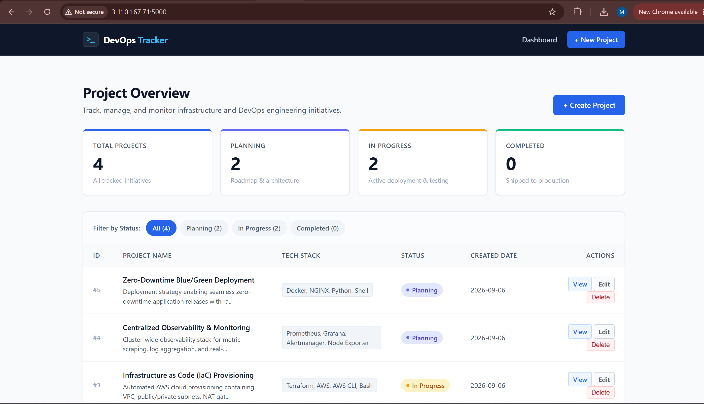
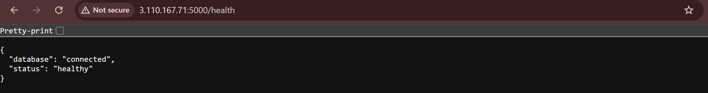
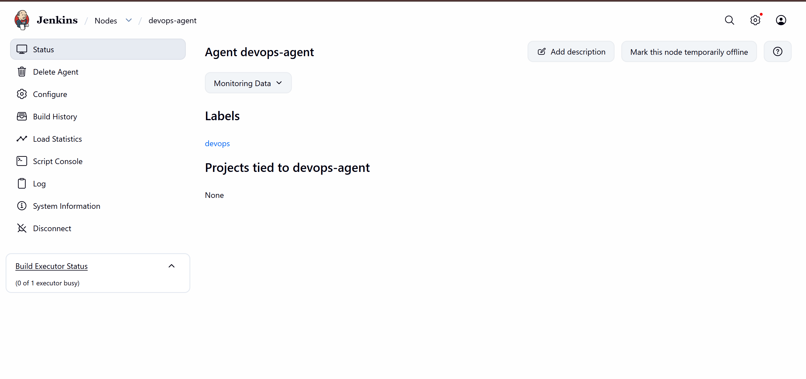
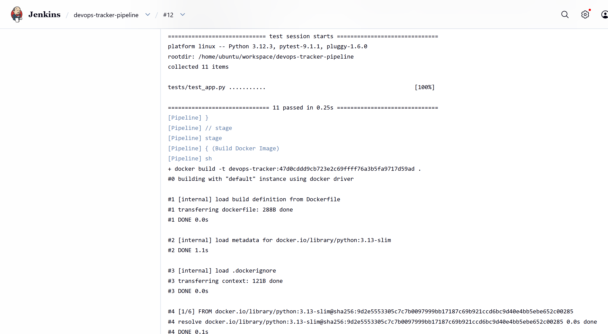
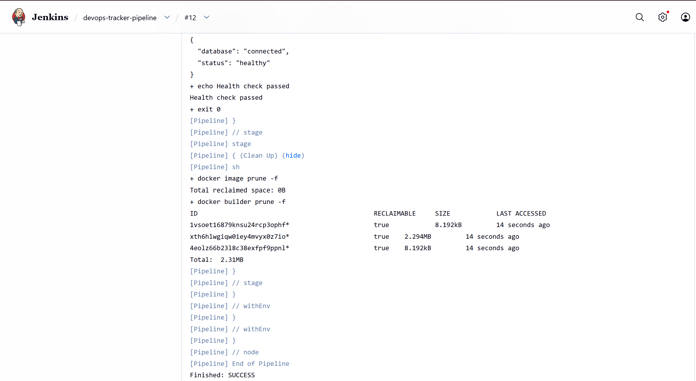
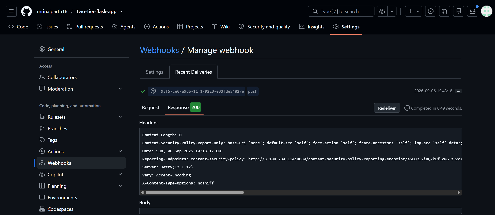

# Two-Tier Flask DevOps Application
This project demonstrates an end-to-end CI/CD workflow using GitHub, Jenkins, Docker, Amazon ECR, AWS EC2, and Trivy. It covers automated testing, container image building, security scanning, image publishing, deployment, and application health verification.

A hands-on DevOps portfolio project demonstrating CI/CD for a containerized Flask + MySQL application using **GitHub, Jenkins, Docker, AWS EC2, Amazon ECR, Docker Compose, and Trivy**.

## 🏗️ Architecture

The project uses two EC2 instances:

- **EC2 #1 — Jenkins Controller:** manages and orchestrates the pipeline.
- **EC2 #2 — Jenkins Agent + Application Host:** executes the pipeline and runs the Flask and MySQL containers.
- **Amazon ECR:** stores Docker images.
- **GitHub:** source control and webhook trigger.

The Jenkins Controller connects to the Agent over SSH using a dedicated key and the Agent uses the `devops` label.

## 🏛️ Final Architecture

The diagram below shows the complete architecture and CI/CD flow used in this project.



## 🛠️ Tech Stack

| Category | Technology |
|---|---|
| Source Control | Git, GitHub |
| CI/CD | Jenkins |
| Cloud | AWS EC2 |
| Registry | Amazon ECR |
| Containers | Docker, Docker Compose |
| Security | Trivy |
| Application | Flask |
| Database | MySQL 8.0 |
| Testing | pytest |
| Automation | GitHub Webhook |

## 🔄 CI/CD Pipeline

The pipeline runs these stages:

**Test → Build Docker Image → Trivy Scan → Push to ECR → Deploy → Health Check → Cleanup**

### 1. Test

Jenkins creates a Python virtual environment, installs the application dependencies, and runs the pytest test suite.

The application test suite passed with **11 tests** during validation.

### 2. Build Docker Image

The Flask application is packaged using the `Dockerfile`.

Images are tagged using the Git commit SHA:

```text
devops-tracker:<GIT_COMMIT>
```

This makes each image traceable to the source code that created it.

### 3. Trivy Scan

Trivy scans the Docker image for vulnerabilities before it is pushed to ECR.

The current pipeline reports **CRITICAL** findings without failing the build. This was chosen as a practical learning/portfolio configuration.

### 4. Push to Amazon ECR

The Jenkins Agent authenticates to ECR using the EC2 IAM role and pushes the Git-SHA-tagged image.

No long-lived AWS access keys are stored in the Jenkinsfile.

### 5. Deploy

Docker Compose pulls the image from ECR and starts/updates the Flask and MySQL services.

The Flask container uses the ECR image while MySQL uses the MySQL 8.0 image.

Normal deployment uses:

```bash
docker compose pull
docker compose up -d
```

`docker compose down` is not used during normal deployment because it would unnecessarily stop the application.

### 6. Health Check

Jenkins checks:

```text
http://localhost:5000/health
```

The check retries up to five times.

A successful response confirms that the Flask application is running and can connect to MySQL:

```json
{
  "database": "connected",
  "status": "healthy"
}
```

### 7. Cleanup

After deployment and health verification, unused Docker images and build cache are cleaned up:

```bash
docker image prune -f
docker builder prune -f
```

This helps control disk usage on the Jenkins Agent.

## 🐳 Application

The application consists of:

- Flask web application
- MySQL 8.0 database
- Docker Compose networking
- Persistent MySQL volume
- `schema.sql` for initial database setup
- `/health` endpoint for application/database verification

The database is persisted using the `mysql-data` Docker volume.

## 🔗 GitHub Webhook

A GitHub push webhook automatically triggers the Jenkins pipeline.

```text
Git push
   ↓
GitHub Webhook
   ↓
Jenkins Controller
   ↓
Jenkins Agent
   ↓
CI/CD Pipeline
```

This removes the need to manually start a build after every push.

## 🔐 Security & Infrastructure

Key practices used in the project:

- EC2 IAM role for ECR access instead of storing AWS access keys.
- Dedicated SSH key for Jenkins Controller → Agent communication.
- `.env` excluded through `.gitignore`.
- `.env.example` provided for configuration reference.
- Trivy used for container vulnerability scanning.
- Docker cleanup added after successful deployment.
- Jenkins Agent disk usage was monitored and the EBS volume was increased to 15 GB after Docker/Jenkins storage pressure.

For the lab webhook test, Jenkins port `8080` was made publicly reachable. A production deployment should use HTTPS and a properly secured ingress/reverse-proxy setup.

## 📁 Repository Structure

```text
Two-tier-flask-app/
├── static/
├── templates/
├── tests/
├── .dockerignore
├── .env.example
├── .gitignore
├── Dockerfile
├── Jenkinsfile
├── app.py
├── docker-compose.yaml
├── requirements.txt
├── schema.sql
└── README.md
```

## 🧪 Validation

The project was validated end-to-end:

- Python tests passed.
- Jenkins Controller and Agent connected successfully.
- Docker image built successfully.
- Trivy scan executed.
- Image pushed to Amazon ECR.
- Flask and MySQL containers deployed successfully.
- `/health` returned database-connected/healthy status.
- Full Jenkins pipeline completed successfully.
- GitHub webhook was configured and connected for automatic triggering.

## 📸 Project Screenshots

### 1. Jenkins CI/CD Pipeline


### 2. Amazon ECR


### 3. Running Flask Application


### 4. Application Health Check


### 5. Jenkins Agent


### 6. Jenkins Test & Docker Build


### 7. Jenkins Deployment & Health Verification


### 8. GitHub Webhook


## 📚 Key Learnings

This project provided hands-on experience with:

- Jenkins Controller/Agent architecture
- Declarative Jenkins pipelines
- GitHub webhooks
- Docker image creation and deployment
- Amazon ECR
- AWS IAM roles
- Git-SHA image versioning
- Trivy security scanning
- Docker Compose
- Automated health checks
- Linux and Docker troubleshooting
- Disk/resource management
- CI/CD failure investigation

## 🚀 Future Improvements

Possible next steps:

- Terraform for infrastructure as code
- Kubernetes deployment
- AWS RDS instead of containerized MySQL
- HTTPS and a reverse proxy
- Secrets Manager / Parameter Store
- Monitoring and centralized logging
- Automated rollback
- Stronger Trivy vulnerability gates
- Separate application infrastructure from Jenkins
- Load balancing and higher availability

## 🎯 Project Outcome

This project demonstrates an automated path from:

**Source Code → Testing → Docker Build → Security Scan → ECR → Deployment → Health Verification**

It is designed as a practical DevOps learning and portfolio project rather than a production-ready architecture.
